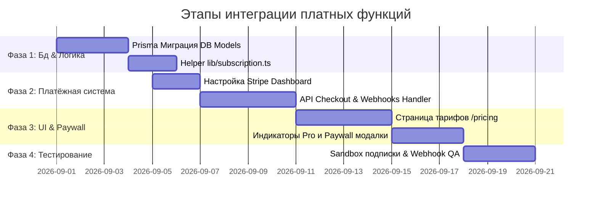

# Архитектура и Стратегия Монетизации · Croatia Mentor

Документ описывает техническую архитектуру, модель данных, выбор платёжных шлюзов и пошаговый план внедрения платных функций, подписок и транзакций на платформе **Croatia Mentor**.

---

## 🎯 1. Стратегия монетизации (Freemium & Hybrid Value Model)

Платформа сохраняет **бесплатный базовый уровень** для поддержки релокантов и студентов, вводя премиальную подписку **Mentor Pro** для пользователей, которым требуется максимальная скорость освоения языка и персональные AI-инструменты.

### 🟢 Бесплатный уровень (Free Tier)
- Полный доступ к базовым урокам грамматики **CEFR A1 — A2**.
- Базовый набор карточек интервального повторения (SRS).
- Лимит на **10-15 сообщений/день** в AI-чате репетитора.
- Доступ к базовым мини-играм (Word Match, Speed Quiz).

### 🚀 Премиум подписка «Mentor Pro» (Monthly / Yearly / Lifetime)
- **Безлимитный AI-репетитор:** Неограниченные диалоги с Google GenAI + голосовая озвучка Edge TTS без лимитов сообщений.
- **20+ Персональных AI-сценариев:** Симуляции собеседования на работу в Загребе, аренды квартиры, визита к врачу, подача документов в полицию (MUP).
- **Курсы CEFR B1 — C2:** Академический, юридический и деловой хорватский язык.
- **Генератор персональных тестов:** Автоматическое создание проверочных работ на основе слабых мест пользователя.
- **Сертификаты с QR-валидацией:** Генерация персонального PDF-сертификата при прохождении каждого уровня.

### 💳 Разовые микротранзакции (Pay-As-You-Go Addons)
- **Пакеты AI-токенов:** Покупка дополнительных 100 сообщений для пользователей без подписки.
- **Экспресс-оценка уровня:** Персональный разбор письменного эссе или устного произношения экспертом.

---

## 💳 2. Выбор платёжных шлюзов (Payment Gateways)

Для покрытия международной аудитории (EU, US) и пользователей из Украины рекомендуется мульти-шлюзовый подход:

```mermaid
graph TD
    User[Пользователь] -->|Выбор тарифа| Checkout[Страница оплаты /pricing]
    Checkout -->|Международная карта / Apple Pay| Stripe[Stripe Checkout / Merchant of Record]
    Checkout -->|Украинская карта / Гривна| Monobank[WayForPay / Monobank Pay / LiqPay]
    Stripe -->|Webhook| WebhookHandler[/api/webhooks/stripe]
    Monobank -->|Webhook| WebhookHandler
    WebhookHandler -->|Обновление статуса| DB[(Prisma PostgreSQL)]
```

### 1. Stripe Checkout & Billing (Основной шлюз для ЕС и Мира)
- **Плюсы:** Мировой стандарт для SaaS-подписок. Поддержка Apple Pay, Google Pay, карт Visa/Mastercard, SEPA Direct Debit.
- **Управление подпиской:** Встроенный **Stripe Customer Portal** позволяет пользователям самостоятельно изменять тариф, привязывать новые карты и отменять подписку без написания в саппорт.

### 2. Lemon Squeezy / Paddle (Альтернатива: Merchant of Record)
- **Плюсы:** Выступают продавцом записи (MoR), полностью берут на себя автоматический расчёт и уплату **VAT/НДС в 50+ странах мира**, а также бюрократию налоговой отчётности.

### 3. WayForPay / Monobank Pay / LiqPay (Шлюз для Украины)
- **Плюсы:** Мгновенная оплата гривневыми картами, через приложение Monobank, Приват24 или Apple/Google Pay с минимальной комиссией.

---

## 🗄️ 3. Расширение схемы базы данных (Prisma Schema Extensions)

Для поддержки подписок, разовых транзакций и ограничений использования необходимо добавить следующие модели в `prisma/schema.prisma`:

```prisma
// ----------------------------------------------------
// 1. ПОДПИСКИ ПОЛЬЗОВАТЕЛЕЙ (User Subscription)
// ----------------------------------------------------
model UserSubscription {
  id                     String             @id @default(cuid())
  userId                 String             @unique
  user                   User               @relation(fields: [userId], references: [id], onDelete: Cascade)
  
  // Платёжный провайдер
  provider               PaymentProvider    @default(STRIPE)
  stripeCustomerId       String?            @unique
  stripeSubscriptionId   String?            @unique
  stripePriceId          String?
  stripeCurrentPeriodEnd DateTime?

  // Статус и тариф
  status                 SubscriptionStatus @default(INACTIVE)
  plan                   PlanType           @default(FREE)
  
  cancelAtPeriodEnd      Boolean            @default(false)
  createdAt              DateTime           @default(now())
  updatedAt              DateTime           @updatedAt
}

// ----------------------------------------------------
// 2. ИСТОРИЯ ТРАНЗАКЦИЙ (Transaction Log)
// ----------------------------------------------------
model Transaction {
  id             String          @id @default(cuid())
  userId         String
  user           User            @relation(fields: [userId], references: [id], onDelete: Cascade)
  
  amount         Int             // Сумма в копейках/центах (напр. 999 = €9.99)
  currency       String          @default("EUR") // EUR, USD, UAH
  provider       PaymentProvider
  providerTxId   String          @unique // External Payment ID
  
  status         TxStatus        @default(PENDING)
  description    String?
  metadata       Json?           // Дополнительные данные провайдера
  
  createdAt      DateTime        @default(now())
}

// ----------------------------------------------------
// 3. УЧЁТ ЛИМИТОВ ИСПОЛЬЗОВАНИЯ (Usage Metering)
// ----------------------------------------------------
model FeatureUsage {
  id           String   @id @default(cuid())
  userId       String
  featureKey   String   // "ai_chat_daily", "tts_daily"
  usageCount   Int      @default(0)
  resetAt      DateTime // Время сброса (напр. полночь)
  
  updatedAt    DateTime @updatedAt

  @@unique([userId, featureKey])
}

// ENUMS
enum SubscriptionStatus {
  ACTIVE
  CANCELED
  PAST_DUE
  UNPAID
  INACTIVE
}

enum PlanType {
  FREE
  PRO_MONTHLY
  PRO_ANNUAL
  LIFETIME
}

enum PaymentProvider {
  STRIPE
  PADDLE
  LEMON_SQUEEZY
  WAYFORPAY
  MONOBANK
}

enum TxStatus {
  PENDING
  SUCCESS
  FAILED
  REFUNDED
}
```

---

## 🛠️ 4. Сервисы и API Роуты (API Architecture)

### 1. Переключатель доступа `lib/subscription.ts`
```typescript
import { prisma } from "@/lib/prisma";

export async function getUserSubscriptionPlan(userId: string) {
  const sub = await prisma.userSubscription.findUnique({
    where: { userId },
  });

  const isPro =
    sub &&
    sub.status === "ACTIVE" &&
    sub.stripeCurrentPeriodEnd &&
    sub.stripeCurrentPeriodEnd.getTime() + 86_400_000 > Date.now();

  return {
    isPro: Boolean(isPro),
    plan: isPro ? sub.plan : "FREE",
    stripeCustomerId: sub?.stripeCustomerId,
    stripeSubscriptionId: sub?.stripeSubscriptionId,
  };
}
```

### 2. Создание сессии оплаты `/api/payments/checkout/route.ts`
```typescript
// 1. Проверка авторизации через NextAuth
// 2. Инициализация Stripe Checkout Session или WayForPay Invoice
// 3. Возврат URL для редиректа пользователя на защищенную страницу оплаты
```

### 3. Обработчик вебхуков `/api/webhooks/stripe/route.ts`
```typescript
// 1. Проверка подписи Webhook Signature (Stripe-Signature)
// 2. Обработка событий:
//    - checkout.session.completed -> Активация подписки UserSubscription
//    - invoice.payment_succeeded -> Продление периода stripeCurrentPeriodEnd
//    - customer.subscription.deleted -> Перевод статуса в CANCELED / INACTIVE
```

### 4. Контроллер лимитов `lib/usage-limit.ts`
```typescript
// Проверка дневного лимита AI-чата для пользователей Free Tier (15 сообщений/день)
export async function checkAiChatLimit(userId: string): Promise<{ allowed: boolean; remaining: number }> {
  const { isPro } = await getUserSubscriptionPlan(userId);
  if (isPro) return { allowed: true, remaining: 9999 };

  // Проверка и инкремент в FeatureUsage
  // ...
}
```

---

## 📋 5. Пошаговый план внедрения (Implementation Roadmap)



### Этап 1: Подготовка инфраструктуры (1 неделя)
1. Установка зависимостей: `npm install stripe @stripe/stripe-js`.
2. Создание аккаунта в **Stripe** или **Lemon Squeezy**, получение API ключей (`STRIPE_SECRET_KEY`, `STRIPE_WEBHOOK_SECRET`).
3. Применение миграции Prisma DB (`npx prisma migrate dev --name add_subscriptions`).

### Этап 2: Бэкенд и Вебхуки (1 неделя)
1. Создание роутов `/api/payments/checkout`, `/api/payments/portal`, `/api/webhooks/stripe`.
2. Внедрение утилит проверки `hasProAccess()` в эндпоинты `/api/chat` и `/api/tts`.

### Этап 3: Фронтенд и UX (1 неделя)
1. Создание продающей страницы тарифов `app/[locale]/pricing/page.tsx` с переключателем Месяц/Год.
2. Добавление стильного бейджа **`PRO`** в профиль и шапку пользователя.
3. Отображение мягкого Paywall-модального окна при исчерпании дневного лимита AI-сообщений.

### Этап 4: Тестирование и Запуск (3 дня)
1. Тестирование с тестовыми картами Stripe (4242...).
2. Проверка сценариев: успешная оплата, отмена подписки, отклонение карты, автопродление.
3. Публикация на продакшен и включение реального режима.

---
*Документ подготовлен для Croatia Mentor · Поддержка интеграции: support@croatia-mentor.space*
